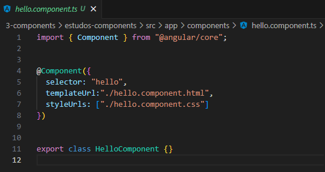
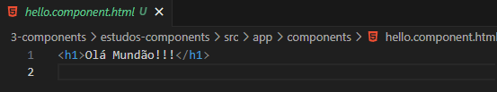
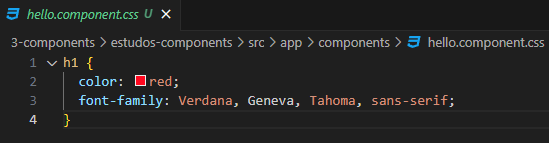
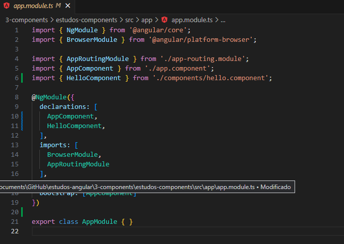
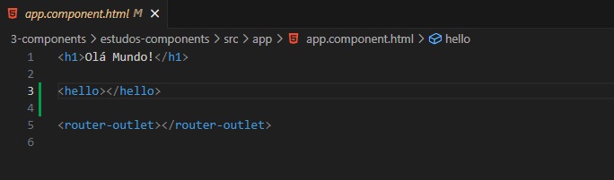

<h1 align="center">Como Criar um Component</h1>

  Aqui iremos mostrar a forma de criar um "**component**" de forma simples.

  <h3>Os Passos Serão:</h3>

  - [Criação do Component](https://github.com/henferreirapro/estudos-angular/blob/3-components-angular/criar-component.md#cria%C3%A7%C3%A3o-do-component)

  - [Registrando o Component](https://github.com/henferreirapro/estudos-angular/blob/3-components-angular/criar-component.md#registrando-o-component)

  - [Utilizando o Component](https://github.com/henferreirapro/estudos-angular/blob/3-components-angular/criar-component.md#utilizando-o-component)

<h2>Criação do Component</h2>

  Nosso primeiro component é composto de 3 arquivos, os arquivos são:
  - [hello.component.ts]()
  - [hello.component.html]()
  - [hello.component.css]()

  ___
  <h3>Vamos Observar o hello.component.ts - Arquivo Principal do Component</h3>
  

  - Na linha 1 basicamente dizemos que nossa aplicação é uma aplicação Angular e importamos dentro do "**@angular core**" a nossa interface "**component**" que é um objeto do Angular.

  - Na linha 4 nós usamos a nossa interface e dentro dela nós declaramos os parametros "**selector**", "**templateUrl**" e "**styleUrls**"

  - O "**selector**" sera como chamamos o nosso component dentro do html, nesse caso seria o "**hello**".

  - O "**templateUrl**" diz para o nosso component qual sera o arquivo HTML que ele irá usar.

  - "**stylesUrls**" também diz para o nosso o local do arquivo CSS que ele irá usar.

  - Na linha 11 nós exportamos a classe que o nosso component será chamado dentro dos "**Modules do Angular**", nesse caso "**HelloComponent**".

  OBS: Usamos as primeiras letras em maiusculo quando declaramos a classe, estilo "**CamelCase**".

  ___
  <h3>Vamos Observar o hello.component.html - Arquivo HTML do Component</h3>
  
  
  - Aqui iremos declarar todas as Tags HTML que nossos "**components**" irão compor.

  - No caso a cima tem apenas um "**h1**" de forma simplificada, más se fosse fazer um menu por exemplo, todas as tags HTML estariam nesse arquivo.

  ___
  <h3>Vamos Observar o hello.component.css - Arquivo CSS do nosso Component</h3>
  

  - De forma basica onde iremos adicionar todos os estilos que nosso component precisar.

  - Lembrando que os estilos serão declarados de forma local, afetando apenas as tags HTML do nosso component em questão.

___
<h2>Registrando o Component</h2>
  

  - Dentro do no "**app.module.ts**" é onde nós iremos "**registrar**" nossos "**components**".

  - Na linha 6 é onde importamos a nossa classe "**HelloComponent**".

  - Na linha 11, dentro "**declarations**" é onde nós "**registramos**" o nosso "**component**"

  - Um ponto legal a observar aqui é que sempre que nós criarmos um component precisaremos registrar ele no nosso "**app.module.ts**", caso contrario a aplicação dará um erro.

___
<h2>Utilizando o Component</h2>
  

  - Após registrar nosso component dentro do "**app.module.ts**" nós podemos usa-lo dentro do nosso "**app.component.html**".

  - Para isso só precisamos chamar o "**selector**" do nosso "**component**" como se fosse uma "**tag HTML**", igual na linha 3 da imagem acima.

___

<h2>Outros Paginas</h2>

- [Voltar Para a Pagina Sobre Components](https://github.com/henferreirapro/estudos-angular/tree/3-components-angular)

- [Ir Para a Pagina Como Fazer Interpolação de Dados](https://github.com/henferreirapro/estudos-angular/blob/3-components-angular/2-interpolar-dados.md)