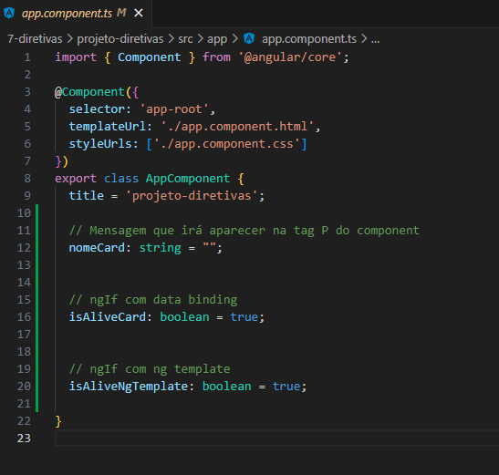
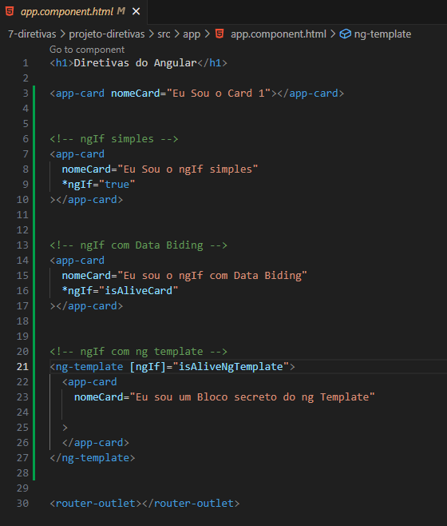
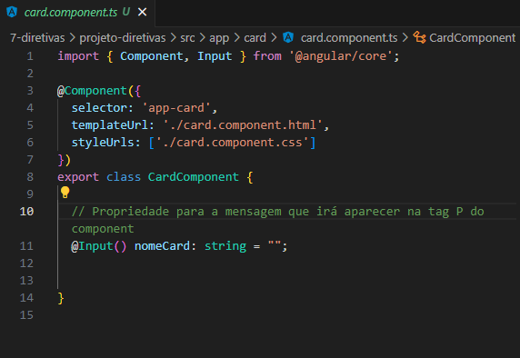
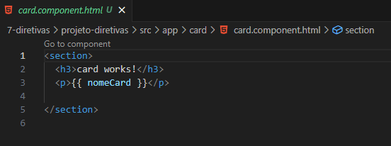
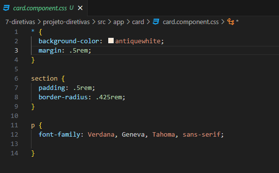

<h1 align="center">Usando ngIf</h1>

  - O "**ngIf**" é uma condição para mostrar ou não algum elemento na sua tela.

  ___
  ___
  <h3> Temos 3 formas basicas de usar o *ngIf : </h3>

  - Forma Simples :  
  Declarando direto na tag HTML dizendo se o elemento é true ou false, caso seja
  false ele não será exibido. 

  
  - Com Data Biding :  
  Nós criamos uma "**propriedade booleana**" no nosso "**arquivo TS**" e por ela
  que iremos adicionar ao "**ngIf na tag HTML**".  
  Essa propriedade que armazenará se o elemento será true ou false.

  
  - Com ng Template :  
  Nós criamos uma tag chamada "**ng-template**" e nela adicionamos o nosso ngIf 
  dentro de colchetes.   
  Podemos declarar se é true ou false "**diretamente**" ou podemos "**atribuir a  
  uma propriedade**".  
  Por padrão "**o ng-template não aparece**" na nossa pagina, ele só irá aparecer 
  se for declarado como true no nosso "**ngIf**".

  ___
  ___
  <h3>Criando as Propriedades Booleanas para usar no HTML :</h3>
  

  - Nas "**linhas 15 e 19**" nós criamos duas "**propriedades**", uma para usar no "**ngIf com Data biding**" e a outra no "**ng-template**".

  - Na "**linha 11**" criamos uma "**propriedade**" chamada "**nomeCard**" que serve apenas para "**adicionarmos o nome de cada card**" diretamente na tag HTML.

  ___
  <h3>Usando o ngIf no HTML :</h3>
  

  - Na "**linha 7**" nós criamos o "**exemplo simples do ngIf**", apenas chamamos o ngIf direto na tag e dizemos se é true ou false.

  - Na "**linha 14**" nós criamos o "**exemplo com Data biding**", chamamos o "**ngIf**" e dizemos a ele que a propriedade "**isAliveCard**" será de onde ele receberá os valores booleanos true ou false.

  - Na linha 22 nós criamos a tag "**ng-template**" e dentro dela adicionamos o "**ngIf dentro de colchetes**" e dentro dele dizemos que a propriedade "**isAliveNgTemplate**" será a responsavel pelos valores true ou false.  
  Lembrando que "**se for true o elemento irá aparecer**", caso seja "**false ou não tenha nada declarado**", o elemento não aparecerá.

  ___
  ___
  <h3>Arquivos TS do app-card :</h3>
  

  ___
  <h3>Arquivos HTML do app-card :</h3>
  

  ___
  <h3>Arquivos CSS do app-card :</h3>
  

___
___
<h2>Outras Paginas :</h2>

[Voltar Para a Pagina Sobre Diretivas](https://github.com/henferreirapro/estudos-angular/tree/7-diretivas-angular)