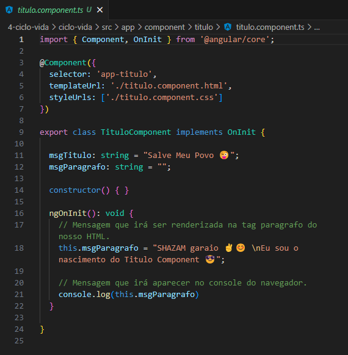
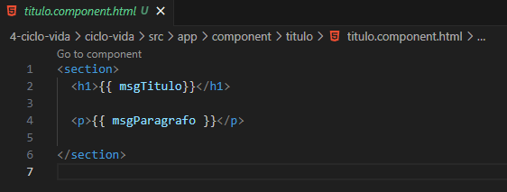
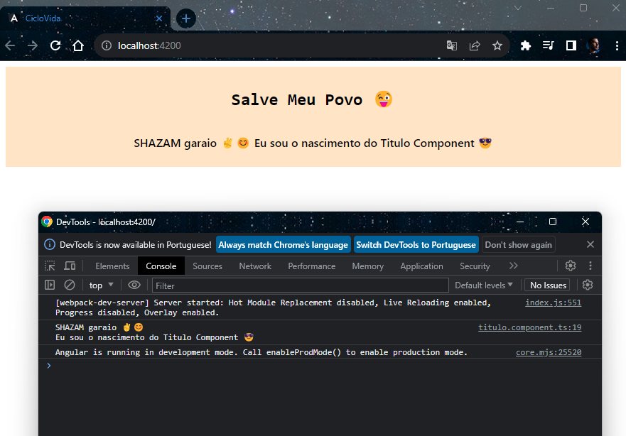

<h1 align="center">On Init</h1>

  - O ngOnInit é uma interface que tem como função ser executada sempre que o nosso component for iniciado, em outras palavras sempre que ele nascer o ngOnInit será executado.

  ___
  ___
  <h4>Criando os Parametros para o ngOnInit :</h4>
  

  - Na linha 16 nós adicionamos o "**ngOnInit**" e dentro dele iremos passar dados que poderão ser usados sempre que o nosso "**Component**" for executado.

  - Na linha 18 nós passamos uma mensagem ao atributo "**msgParagrafo**", esse exemplo é para demonstrar que podemos enviar uma mensagem ou qualquer outro dado ou função ao nosso HTML assim que nosso component for executado.

  - Na linha 21 adicionei um "**console.log**" com o "**parametro msgParagrafo**" para deixar como exemplo que podemos usar o "**ngOninit**" por tras dos panos sem a necessidade do usuario final visualizar o que esta sendo feito.

  - Dessa forma poderiamos por exemplo usa-lo quando estivermos fazendo algum teste ou precisando visualizar a execução de algo em especifico no nosso "**Component ao inicia-lo**".

  ___
  <h3>Passando os Parametros no HTML do Component :</h3>
  

  - Na linha 2 e 4 nós passamos os parametros "**msgTitulo**" e "**msgParagrafo**" criado no nosso "**arquivo TS**".

  - A msgTitulo seria um parametro que será executado direto ao HTML, já a msgParagrafo ela recebe o que ira ser renderizado do "**ngOnInit**".

  - Dessa forma basicamente poderiamos até "**mudar o que apareceria em qualquer tag**" do nosso component, por exemplo "**passar outro dado**" ao parametro "**msgTitulo**", assim ao invés dele mostrar a mensagem Salve "**Meu Povo 😜**" iria mostrar outra mensagem.

  - Em outras palavras o "**Component**" iri iniciar com a mensagem original más iria receber outra mensagem no lugar e isso não seria percebido pelo usuario final por exemplo.

  ___
  <h3>Exemplo da Pagina :</h3>
  

  - Aqui podemos ver que as "**mensagens foram executadas corretamente**" e que no console do nosso navegador aparece a mensagem do nosso "**ngOnInit**".

___
___
<h2>Outros Paginas</h2>

[Voltar Para Pagina Inicial de Gerenciamento de Estados](https://github.com/henferreirapro/estudos-angular/tree/4-gerenciamento-estados-angular)