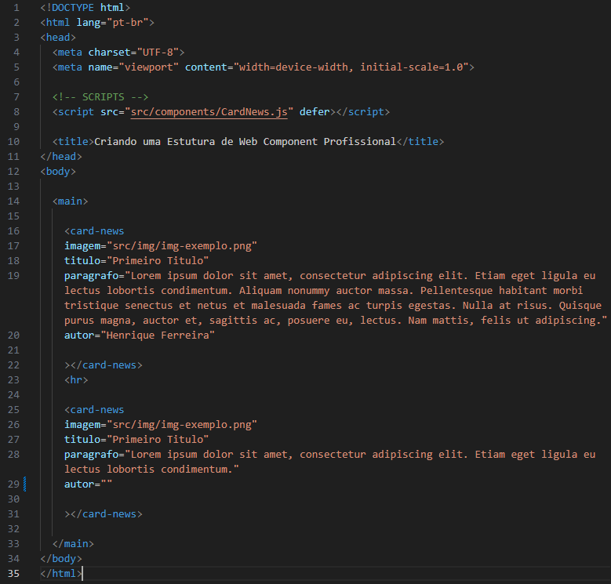
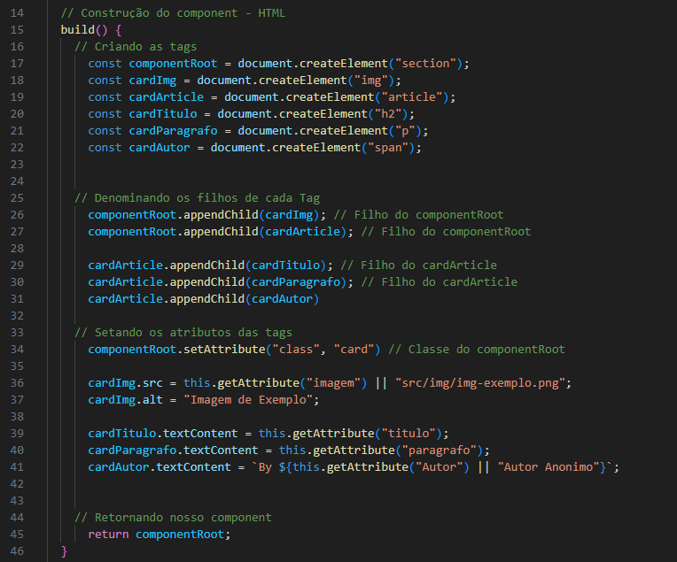
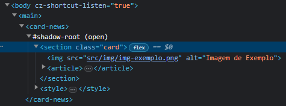
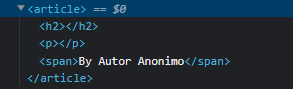
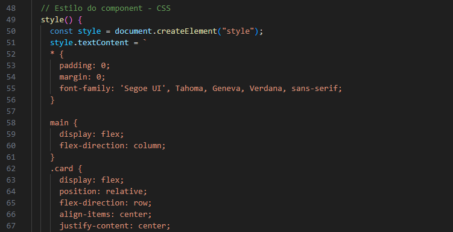

<h1 align="center">Estrutura De um Webcomponent Completo</h1>

- Irei deixar aqui uma estrutura de Webcomponent completa.

<h4>Essa estrutura ira conter:</h4>

- O "**index.html**" do nosso exemplo.
- Webcomponent chamado "**CardNews**".
- As pastas onde cada component fica de forma simples.

___
- Irei deixar explicado cada parte de forma basica para o nosso entendimento, espero que tenham lido os "**exemplos simples**" pois por ele já deixei basicamente todas as estruturas explicadas.

Então, vamos nessa! ✍️📋✌️

<h2>Estrutura Web Component:</h2>
<h3>HTML da estrutura:</h3>
  

  <h4>Vamos observar a linha 8:</h4>

  - Na linha 8 chamamos o nosso webcomponent "**CardNews**".
  - Vale observar que existe um parametro chamado "**defer**", esse parametro faz com que o nosso script seja executado apenas depois de toda a pagina ser carregada.
  - Sem o uso do "**defer**" em uma aplicação maior "**podemos ter lentidão ou até erro no carregamento da pagina**" caso o script seja executado antes do HTML ser carregado.

  <h4>Vamos observar as linhas 16 a 22:</h4>
  
  - Entre as linhas 16 a 22 temos o nosso "**CardNews**" invocado.
  - Na linha 17 temos o "**parametro imagem**" que irá enviar ao nosso "**CardNews**" a imagem que ele precisa mostrar.
  - Na linha 18 temos o "**parametro titulo**" que será o titulo do nosso card.
  - nas linhas 19 e 20 temos os "**parametros paragrafo e autor**" que serão para o paragrafo e autor do nosso card.

  Bem facil de entender? 
  Não irei falar da **linha 25 a linha 31** pois basicamente é a mesma coisa do que foi dito a cima só que os **parametros estão diferentes**.

___
<h3>Estrutura do CardNews:</h3>
  

  <h4>Vamos observar as linhas 6, 9 e 10:</h4>
  
  - Na linha 6 declaramos nossa sombra.
  - Na linha 9 declaramos que "**build()**" é filho do nosso componente "**shadowDOM**" Ele será responsavel pelo corpo do nosso component, nosso "**componentRoot**".
  - Na linha 10 igual a linha 9 declaramos que o "**styles()**" é filho da noss "**shadowDOM**", responsavel pelo estilo do nosso component.
  
  <h3>Vamos observar a "build()", linhas 15 a 46:</h3>
  

  - Dentro da nossa "**build()**" vemos que ela é separada por 4 partes, vamos ver cada uma delas.

  <h4>Observando as linhas 17 a 22:</h4>
  Essas linhas são responsaveis pela criação dos nossos componentes HTML.
  
  - Na linha 17 definimos o nosso "**componentRoot**", que será a TAG principal do no webcomponent "**CardNews**", ela será uma "**section**".
  - Na linha 18 definimos o nosso "**cardImg**" que será uma TAG "**img**".
  - Na linha 19 definimos nosso "**cardArticle**", será uma tag "**article**".
  - Na linha 20 definimos nosso "**cardTitulo**", será uma tag "**h2**".
  - Na linha 21 definimos nosso "**cardParagrafo**", será uma tag "**p**".
  - Na linha 22 definimos nosso "**cardAutor**", será uma tag "**span**".
  

  <h4>Observando as linhas 26 a 31:</h4>
  Essas linhas serão responsaveis para dizer quais serão as "**tags pai**" e as "**tags filhos**".

  - Nas linhas 26 e 27 estamos dizendo que o nosso "**cardImg**" e "**cardArticle**" são filhos do nosso "**componentRoot**", então dentro da nossa tag section terão "**uma tag img e uma tag article**".

  Aparecera dessa forma: 
  

  ___
  - Nas linhas 29, 30 e 31 estamos dizendo que o nosso cardTitulo, cardParagrafo e cardAutor serão filhos do nosso cardArticle.

  Aparecera dessa forma: 
  
  
  ___
  <h4>Observando as linhas 34 a 44:</h4>
  Nessas linhas nós passamos os "**parametro e atributos**" que cada tag irá receber.

  - Na linha 34 nós passamos que o "**componentRoot**" irá receber uma "**class**" com nome "**card**".

  - Na linha 36 nós passamos para o nosso cardImg o parametro src que virá do parametro "**imagem**", caso não tenha um parametro "**imagem**" ou ele esteja vazio ele irá pegar pelo caminho descrito a frente.

  - Na linha 37 adicionamos um atributo alt no nosso "**cardImg**" caso a imagem não carregue será exibido um texto identificando a imagem.

  - Nas linhas 39 e 40 passamos os parametros do "**carditulo**" e do "**cardParagrafo**", sem pontos a observar.

  - Na linha 41 nós passamos para o nosso "**cardAutor**" o parametro "**autor**", caso não tenha ele exibirá "**Autor Anonimo**".

  - Na linha 44 nós retornamos o nosso "**componentRoot**".

  ___
  <h3>Observando agora a noss style(), linhas 49 a 122:</h3>
  

  - Na Linha 50 nós criamos o nosso elemento style.
  - Entre as linhas 52 a 122 nós colocamos todos os nossos estilos CSS como uma folha CSS normal, só que dentro de aspas duplas.

  Não irei deixar o print de toda a folha pois ela ficou um pouco grande kk então irei deixar apenas o começo para entenderem um pouco como seria feito.
  
  Basicamente seria pegar uma folha CSS e colar dentro das aspas duplas.

___

Irei deixar a baixo a pagina com a estrutura e os código do HTML e do CardNews.

[Estrutura do CardNews e HTML do Exemplo](https://github.com/henferreirapro/estudos-angular/tree/1-web-components-no-front-end/1-web-components/3-estrutura-component-profissional)

[Acesse a Pagina do Exemplo]()