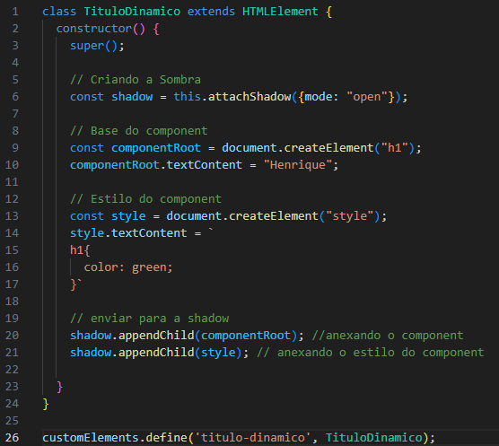

<h1 align="center">Estrutura simples HTML5 vs Webcomponent</h1>

- Aqui irei falar um pouco sobre a diferença de uma estrutura simples de um HTML(element) e um Webcomponent.

- No Exemplo abaixo teremos um "**Olá Mundo**" feito no HTML e um feito com Webcomponent, apenas isso para poder ter um entendimento e comparação basico.

___

<h2>Exemplo com HTML:</h2>

  - Nesse exemplo usamos um **h1** para imprimir um "Olá Mundo!".
  - Nós declaramos o **h1** direto no **body** da estrutura HTML, é algo bem simples más pense se precisassemos imprimir varias vezes o mesmo **h1**, se fosse 2 a 3 vezes seria algo ok, más para reutilizarmos varias vezes seria algo que gastaria muito tempo.

___
<h2>Exemplo com Webcomponent:</h2> 
  <h4>Estrutura do HTML:</h4>
  

  - Já usando um webcomponent podemos aproveitar o mesmo **h1** em diversos locais diferentes, tendo que escreve-lo apenas uma vez.
  - Nesse exemplo acima, nós chamamos o web-component "**CardNews**" e ele nos retorna na nossa shadow DOM um **h1** com nosso "**Olá Mundo!**" escrito.
  - Essa ideia é ótima pois se quisermos usar varias vezes a mesma estrutura podemos apenas invocar nosso "**CardNews**" que já teremos ela pronta no nosso HTML.
  

  <h4>Estrutura do "CardNews":</h4>
  

  - No cardnews nós primeiro criamos a class CardNews, extendendo do elemento HTML "**extends HTML element**".
  - Depois dentro dela chamamos nosso "**Constructor**" e dentro dele o nosso "**super**" e o código do nosso webcomponent.
  - Dentro da nossa função nós criamos nossa "**shadow DOM**" e depois a chamamos em baixo dando o nosso "**innerHTML**".
  - Por fim nós usamos o "**customElement.define**" para poder definir o nome do webcomponet e quem é ele.
  
___
<h2>Usando Props e dinamismo</h2>
  
  - Nosso webcomponent também pode receber parametros para serem impressos outras coisas e até com outras formatações.
  - Irei adicionar mais dois exemplos usando titulo dinamico e props para poder mostrar um pouco mais de dinamica ao nosso webcomponent.

  <h3>Usando titulo com dinamismo:</h3>
  

  <h4>Vamos observar agora a linha 9 e 10:</h4>

  - Nelas nós criamos o nosso "**componentRoot**" e nele declaramos que ele será uma "**TAG h1**".
  - Na linha 10 nós chamamos o **componentRoot** e declaramos usando o "**textContent**" que o nosso titulo receberá "**Henrique**".
  - Dessa forma estamos declarando o que será escrito dentro do nosso webcomponent.
  - Isso nos tras um pouco mais de liberdade de poder imprimir o component com textos diferentes, más ainda sim todos os components seriam limitados ao mesmo texto.

  <h4>Vamos observar agora a linha 13 e 14:</h4>

  - Nessas linhas nós criamos o elemento style e dentro dele nós declaramos o nosso estilo do component "**TituloDinamo**"
  - Vale observar que todo estilo criado no nosso component é de escopo "**LOCAL**" e não será afetado se tivermos outro component no escopo "**GLOBAL**".

  <h4>Vamos observar agora a linha 20 e 21:</h4>

  - Nessas linhas nós denominamos que os components "**componentRoot**" e "**style**" são componentes filhos da nossa "**shadowDOM**"

  <h4>Retorno dentro do nosso HTML:</h4>
  

  ___
  <h3>Usando Titulo com Props:</h3>
  

  <h4>Vamos observar a linha 10:</h4>
  
  - Diferente do exemplo anterior, agora atribuimos no nosso "**componentRoot**" que o que será escrito no nosso component será o que vier do "**parametro titulo**" que será declarado no nosso HTML na hora de chamar o nosso webcomponent.

  <h4>Estrutura do HTML:</h4>
  

  <h4>Vamos observar a linha 20:</h4>

  - Na linha 20 do nosso HTML chamamos o nosso "**TituloProps**" e dentro dele nós passamos nosso parametro "**titulo**" com o titulo que será escrito na nossa pagina.
  - Com isso podemos escrever qualquer coisa dentro do parametro "**titulo**" e isso será impresso na pagina sem a necessidade de fazer algum novo h1 ou código, pois tudo já esta pronto e só precisamos chamar nosso "**TituloProps**".
  - Na linha 10 nós dizemos ao HTML de onde esta vindo o nosso "**TituloProps**"
  
  <h4>Retorno dentro do nosso HTML:</h4>
  

  ___
[Ir para a Estrutura Profissional](https://github.com/henferreirapro/estudos-angular/blob/1-web-components-no-front-end/1-web-components/exemplo-estrutura-profissional.md)
