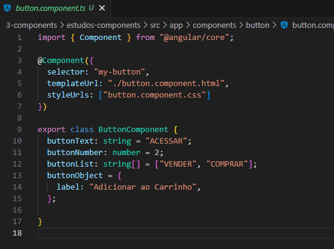
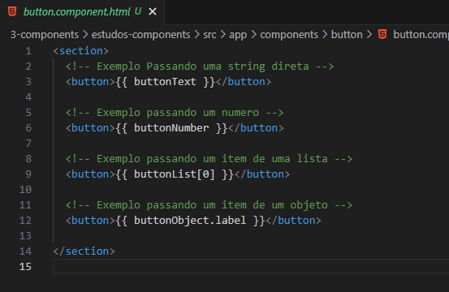

<h1 align="center">Interpolando Dados Direto no Component</h1>

  - Aqui iremos adicionar dados no nosso component más de forma direta, fazendo assim o component ficar mais reutilizavel.
  - Iremos adicionar dentro da classe do Component os dados que serão impressos no nosso component.

___
  <h3>Declarando as Variaveis Dentro da Classe do Component :</h3>
  

  - Entre as linhas 9 a 15 nós iremos adicionar as variaveis que serão exibidas dinamicamente no nosso component.

  - Na linha 10 temos a variavel "**buttonText**" que possui uma "**string**".
  
  - Na linha 11 temos a variavel "**buttonNumber**" que possui um item "**numérico**".
  
  - Na linha 12 temos a variavel "**buttonLista**" que possui uma "**lista com 2 itens**".
  
  - Na linha 13 e 14 temos a variavel "**buttonObject**" que tem um "**objeto**" chamado "**label**" com uma string dentro.

  OBS: Quando declaramos alguma variavel dentro da classe, nós add o nome dela seguido de dois pontos " **:** " e qual o tipo dessa variavel, se será string, number, boolean etc...

  ___
  <h3>Adicionando os Dados no Nosso Component :</h3>
  

  - Basicamente para declararmos um component nós precisamos adicionar o nome da variavel entre duas chaves " **{{ }}** " dentro da nossa tag, na onde iriamos escrever o texto caso fosse um HTML comum.

  - Podemos ver isso nas linhas 3, 6, 9 e 12.

  - Nas linhas 3 e 6 declaramos as nossas variaveis que tem string e number.

  - Na linha 9 declaramos o item 0 da nossa variavel lista.

  - Na linha 12 nós chamamos o nosso buttonObject seguido do objeto que queremos acessar dentro dele.

___

<h2>Outros Paginas</h2>

  - [Voltar Para a Pagina Sobre Components](https://github.com/henferreirapro/estudos-angular/tree/3-components-angular)

  - [Voltar Para a Pagina Como Criar Um Component Simples](https://github.com/henferreirapro/estudos-angular/blob/3-components-angular/1-criar-component.md)