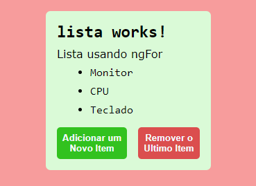

<h1 align="center">Usando *ngFor</h1>

  - O "**ngFor**" funciona como um laço for em qualquer linguagem, más podemos usar ele diretamente no HTML do nosso componente.

  - Com o "**ngFor**" nós podemos passar uma lista com itens para uma tag de lista no HTML e ele irá renderizar essa lista sem a necessidade de criarmos novamente a mesma estrutura por exemplo.

  - Nós também podemos usar a reatividade no "**ngFor**", assim quando algum evento fosse executado ele poderia adicionar ou excluir itens da nossa lista que esta aparecendo na nossa view.

  - Também podemos usar o ngFor com Index da lista, assim podemos saber qual item da lista desejamos usar ou até mesmo fazer alterações.

  ___
  ___
  <h3>Criando a Nossa Lista e Add Itens a Ela :</h3>
  

  - Na "**linha 14**" nós criamos uma lista chamada produtos sem itens.

  - na "**linha 17**" nós adicionamos dentro do nosso "**constructor**" os itens que serão adicionados a nossa lista.

  ___
  <h3>Usando o ngFor :</h3>
  

  - Na "**linha 5**" do HTML do nosso componente nós criamos uma "**Tag ul**" e dentro dela adicionamos uma "**tag li**".

  - Na "**linha 6**" dentro da nossa "**tag li**" nós chamamos o "***ngFor**" e dentro dele nós dizemos ao ngFor que a "**let item**" vai receber os itens dentro da nossa lista produto.

  - E dessa forma cada "**item**" será exibido dentro da nossa "**tag li**".

  - Dessa forma o "**ngFor**" irá criar uma "**tag li**" e mostrará o qual é o valor da "**let item**".

  - Em outras palavras se nossa lista tivesse 10, 300 ou 2 itens o "**ngFor**" iria criar uma "**tag li**" para todos eles e "**renderizar item a item**" na nossa tela.

  ___
  <h3>CSS do nosso Componente app-lista :</h3>
  

  ___
  <h3>Adicionando o Componente app-lista no Nosso APP Component HTML :</h3>
  

  - Na "**linha 30**" nós adicionamos o nosso app-lista ao HTML do nosso app component.

  ___
  <h3>Renderização do app-lista na Nossa Aplicação :</h3>
  

  ___
  ___
  <h2>Usando ngFor com Reatividade</h2>
  

  - Na "**linhas 27**" nós criamos a função "**adicionar( )**", quando ela for chamada irá adicionar um novo item a nossa lista produtos, no exemplo irá adicionar uma string "**Novo Produto**".

  - Na "**linha 32**" criamos a função "**remover ()**" que assim que for chamada irá excluir o ultimo item da lista produtos que for encontrado.

  ___
  <h3>Adicionando as Funções no Nosso HTML :</h3>
  

  - Nas "**linhas 10 e 11**" nós criamos duas "**tags button**" que recebem um "**evento click**" e dentro dele passamos a função "**adicionar e remover**".

  - Então assim que clicarmos em adicionar nossa lista irá receber um "Novo Produto" e de forma reativa o nosso ngFor já irá renderiza-lo na nossa tela.

  - E quando clicarmos em remover o ultimo item ele sumirá da nossa lista mostrada na tela.

  - Nesse exemplo usei uma string para adicionar ou remover más as nossas funções podem ser utilizadas de forma dinamica passando atributos a ela sem a necessidade de declarar diretamente.

  ___
  <h3>Renderização ao Clicar na Opção de Adicionar :</h3>
  

  ___
  <h3>Renderização ao Clicar na Opção de Remover :</h3>
  
  
  
  ___
  ___
  <h2>Usando ngFor com Index</h2>
  