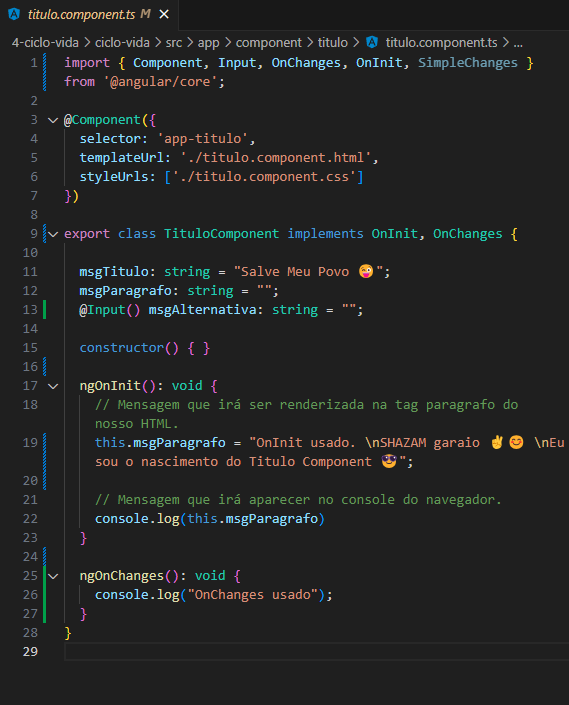
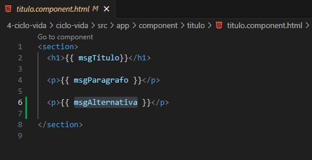
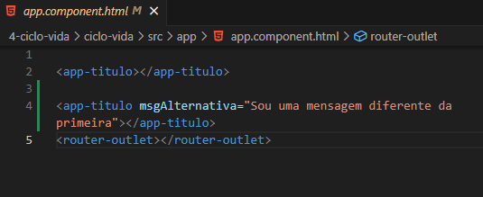
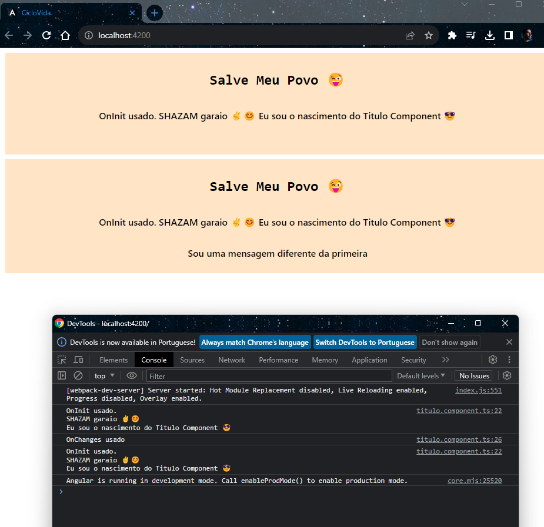

<h1 align="center">OnChanges</h1>

  - O "**OnChanges**" é um evento que sempre é chamado quando uma propriedade do nosso "**Component**" é "**inputado ou alterado**".

  - Em outras palavras ele sempre será executado para nos "**notificar ou demonstrar**" que uma propriedade teve alguma mudança.
  ___
  ___
  <h3>Inplementando OnChanges no Nosso Component :</h3>
  

  - Na "**Linha 1 nós importamos**" o nosso OnChanges e "**chamamos ele na linha 9**" após o implements da nossa classe.

  - Na "**linha 13**" nós criamos uma "**variavel com nome de msgAlternativa**" e "**inputamos**" ela para que ela possa receber um parametro direto na chamada do nosso component dentro do nosso "**app.component.html**"

  - Na "**linha 25**" nós usamos o nosso "**OnChanges**" com um simples "**console.log**" para podermos "**ve-lo no console do navegador**" quando for executado alguma "**alteração**" em alguma propriedade do nosso componente.

  ___
  <h3>Adicionando Nossa Propriedade ao Component HTML : :</h3>
  

  - Na linha 6 adicionamos uma tag "**p**" com a nossa propriedade "**msgAlternativa**" criada na classe do nosso "**arquivo TS**".

  ___
  <h3>Fazendo a Alteração da nossa Propriedade :</h3>
  

  - Na "**linha 4**" nós chamamos o nosso component "**app-titulo**" e "**inputamos a propriedade**" msgAlternativa com "**uma mensagem para ser renderizada**" direto no nosso component.

  ___
  <h3>Retorno na Pagina da Aplicação e Console do Navegador :</h3>
  

  - Aqui temos o retorno do Paragrafo do segundo componente e vemos no console do navegador que o nosso OnChanges foi executado.

___
___
<h2>Outros Paginas</h2>

[Voltar Para Pagina Inicial de Gerenciamento de Estados](https://github.com/henferreirapro/estudos-angular/tree/4-gerenciamento-estados-angular)