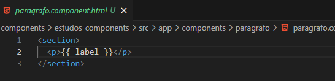

<h1 align="center">Deixando o Component Reutilizavel / Dinamico</h1>

  - Iremos agora deixar nossos "**Components**" mais dinamicos, passando o que será "**impresso**" diretamente no "**Component**"

  - No Exemplo abaixo irei criar um "**Component**" de um paragrafo simples.

  - E esse paragrafo irá receber um parametro do seu component pai, que no caso será o "**app.component.ts**", com o que será impresso dentro do "**component**" paragrafo.

  - Basicamente o "**Component Filho**" ira receber os dados direto do seu component pai na hora de ser chamado dentro do "**app.component.html**".

  ___
  <h3>Criando as Variaveis que Iremos Exibir:</h3>
  

  - Dentro do Nosso "**app.component.ts**" iremos criar nossas variaveis dentro da classe do nosso "**Component**".

  - Nas Linhas 11 e 13 nós criamos os dois parametros que serão usados no nosso paragrafo.

  - Não tem muito segredo, criamos uma string simples com um texto.

  ___
  <h3>Adicionando um Input no nosso Component:</h3>
  

  - Dentro do nosso "**paragrafo.component.ts**" iremos importar um Input e adiciona-lo dentro da classe do nosso Component "**MeuParagrafo**".

  - Na linha 12 nós invocamos o nosso input utilizando um "**@input**" seguindo de parenteses.

  - Depois disso dizemos ao input que nosso component receberá um parametro chamado "**label**" e que ela será uma string.

  ___
  <h3>Criando o HTML do nosso Component Paragrafo:</h3>
  

  - Dentro do nosso "**paragrafo.component.html**" nós criamos uma tag "**section**" e dentro dela uma tag "**p**".

  - Na linha 2 nós adicionamos "**duas chaves**" dentro do nosso paragrafo e dentro das chaves nós adicionamos o "**parametro label**" criado no nosso "**paragrafo.component.ts**".

  - Dessa forma o nosso component paragrafo já estará recebendo qualquer tipo de variavel dinamicamente quando adicionarmos um parametro label dentro da nossa tag "**meu-paragrafo**".

  ___
  <h3>Adicionando as Variaveis que Serão exibidas no nosso Component:</h3>
  

  - Iremos passar a nossa variavel "**label**" de duas formas, usando "**interpolação**" e "**property binding**".

  - Na "**linha 9**" nós passamos o parametro "**label**" utilizando "**aspas duplas**" e dentro dela utilizamos "**duas chaves**" com o nome da "**variavel**" que foi criada na "**linha 13**" do nosso "**app.component.ts**".

  - Na "**linha 10**" nós usamos a nossa "**label**" seguida de "**aspas duplas**" más declaramos o texto que será escrito diretamente no nosso "**Component**".

  - Na "**linha 13**" nós declaramos a nossa "**label**" dentro de "**colchetes**" seguida de "**aspas duplas**" e o nome da variavel na "**linha 11**" do nosso "**app.component.ts**", parecido com a forma que declaramos na interpolação da "**linha 9**".

  - Na "**linha 14**" nós também usamos a nossa "**label**" dentro de "**colchetes**" seguido de "**aspas duplas**", más aqui para podermos escrever um texto diretamente precisamos usar "**aspas simples**" dentro de aspas duplas.

  A grande diferença de declarar utilizando interpolação ou property binding é que com "**interpolação**" usamos a "**label sem colchetes seguida de aspas duplas**" e com a "**propety binding**" nós usamos a "**label dentro de colchetes**".

  As "**formas recomendadas**" de declarar seriam as da "**linha 9 e 13**", podemos declarar direto igual da linha 10 dependendo da necessidade más as duas mais recomendadas são as outras duas.

  ___

<h2>Outros Paginas</h2>

  - [Voltar Para a Pagina Sobre Components](https://github.com/henferreirapro/estudos-angular/tree/3-components-angular)

  - [Voltar Para a PaginaComo Fazer Interpolação de Dados](https://github.com/henferreirapro/estudos-angular/blob/3-components-angular/2-interpolar-dados.md)

  - [Voltar Para a Pagina Como Fazer Interpolação de Dados](https://github.com/henferreirapro/estudos-angular/blob/3-components-angular/2-interpolar-dados.md)