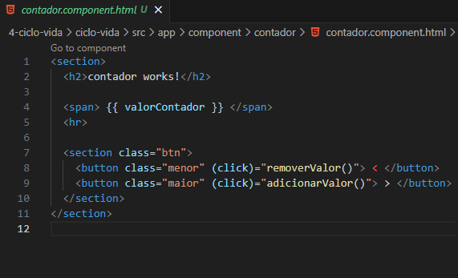
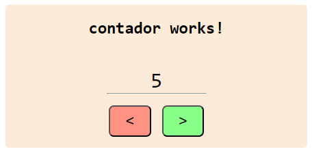

<h1 align="center">DoCheck e seus Sub-Eventos</h1>

  - O "**DoCheck**" sempre é chamado quando temos uma alteração no nosso componente / aplicação.

  - Ele é composto de "**4 sub-eventos**" alem dele mesmo que podem ser muito uteis na hora de "**verificarmos a execução dos nossos componentes**".

  <h3>Os Sub-Eventos do DoCheck : </h3>

  - **ngAfterContentInit :**  
  Esse evento é executado apenas uma vez no inicio da nossa aplicação quando o conteudo do nosso componente é executado.

  ___
  - **ngAfterViewInit :**  
  Ele é executado também apenas uma vez depois que a view do nosso componente é iniciada.

  ___
  - **ngAfterContentChecked :**  
  Esse evento é executado pela primeira vez logo após o "**afterContentInit**".   
  Depois ele sempre será chamado quando tivermos uma alteração no nosso conteudo.  
  basicamente ele fica monitorando se o conteudo do nosso componente foi alterado.

  ___
  - **ngAfterViewChecked :**  
  Ele é executado pela primeira vez após o "**ngAfterViewInit**" ser executado.   
  Depois ele sempre será chamado quando tivermos uma alteração na nossa view.  
  Ele serve para monitorar as alterações da view do nosso componente.

  ___
  ___
  <h3>Como Importar O DoCheck e seus Sub-Eventos :</h3>
  

  - Aqui não tem muito segredo, apenas importamos cada evento e adicionamos na classe do nosso componente.

  ___
  ___
  <h3>Funções Criadas Para o Exemplo do Contador :</h3>
  

  - Nós usamos como exemplo um contador que começa em zero e conforme nós clicamos nos botões de aumentar ou diminuir nós chamamos uma das funções "**adicionarValor()**" ou "**removerValor()**" para somar ou subtrair o número do contador.

  - Na "**linha 28**" nós criamos a variavel "**valorContador**" que começa com o número 0, para ser usada no nosso contador.

  - Na "**linha 31**" nós temos a função "**adicionarValor()**" que pegará o valor da variavel "**valorContador**" e adicionará mais 1 a sua contagem.

  - Na "**linha 36**" nós criamos a função "**removerValor()**" que irá subtrair menos 1 da variavel "**valorContador**".

  ___
  ___
  <h3>Do Check e seus Sub-Eventos :</h3>
  
  

  - Na linha 48 nós criamos o DoCheck com um "**console.log**" que irá aparecer sempre que ele for chamado, mostrando o número do contador naquele momento de alteração.

  - Na linha 53 criamos o "**ngAfterContentInit**" com um "**console.log**" que irá aparecer apenas uma vez na hora que ele for chamado.

  - Na linha 58 criamos o "**ngAfterViewInit**" com um "**console.log**" que irá aparecer apenas uma vez na hora que ele for chamado.

  - Na linha 62 criamos o "**ngAfterContentChecked**" com um "**console.log**" que irá aparecer todas as vezes que ele for chamado.

  - Na linha 68 criamos o "**ngAfterViewChecked**" com um "**console.log**" que irá aparecer todas as vezes que ele for chamado, mostrando o número atual do contador.

  ___
  ___
  <h3>HTML do Nosso Component :</h3>
  
  
  - Na linha 4 nós adicionamos uma tag span e dentro dela adicionamos a variavel "**valorContador**" que mostrará e atualizará o número do contador.

  - Na linha 8 adicionamos uma tag button com uma "**classe chamada menor**" e chamamos o "**evento click**" que executa a função "**removerValor()**".

  - Na linha 9 adicionamos uma tag button com uma "**classe chamada maior**" e chamamos o "**evento click**" que executa a função "**adicionarValor()**".

  - A classe menor e maior servem para o estilo CSS criado para esse componente.

  ___
  ___
  <h3>Retorno do Console do nosso Navegador:</h3> 
  

  - Quando Executamos a nossa aplicação a primeira vez, ela retorna todos os eventos do DoCheck mostrando que o contador esta em 0 e com todas as mensagens feitas para cada evento e sub-evento.

  ___
  

  - Agora o nosso console retorna apenas os eventos "**DoCheck**", "**ngAfterContentChecked**", "**ngAfterViewChecked**" mostrando que houve uma alteração do nosso contador para o número 1.

  ___
  <h3>View do Nosso Component :</h3>
  

  ___
  <h3>CSS do Nosso Component :</h3>
  

___
___
<h2>Outros Paginas</h2>

[Voltar Para Pagina Inicial de Gerenciamento de Estados](https://github.com/henferreirapro/estudos-angular/tree/4-gerenciamento-estados-angular)