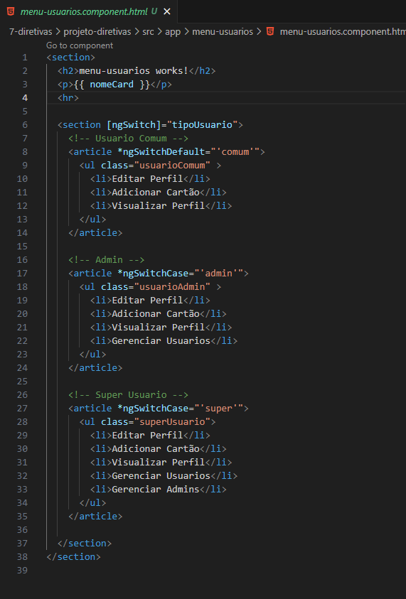
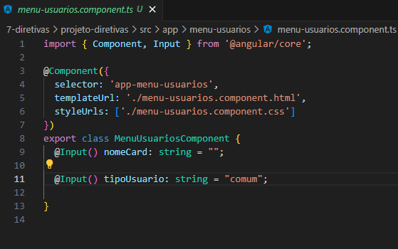
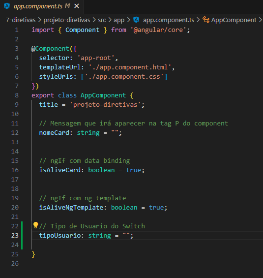
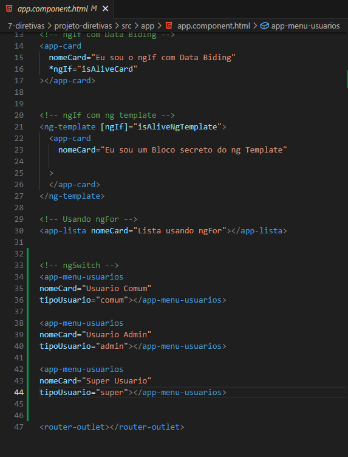
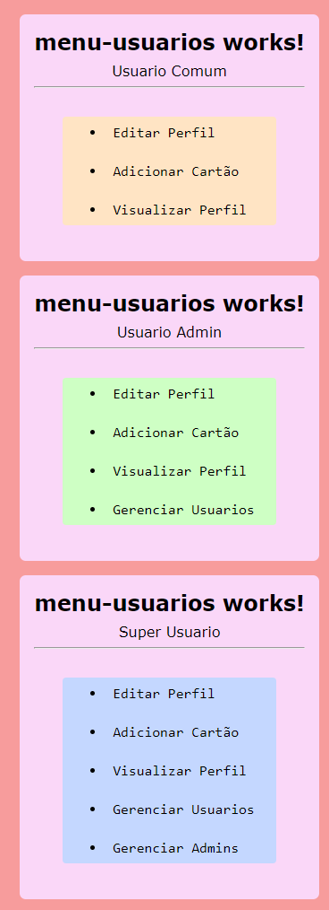
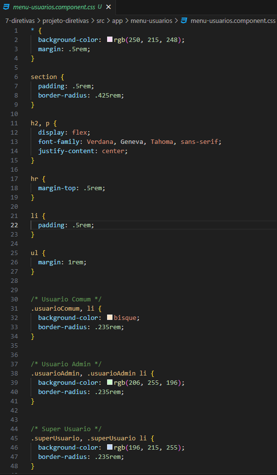

<h1 align="center">Como Usar ngSwitch</h1>

  - Podemos usar o "**ngSwitch no HTML do nosso componente**" para quando precisamos de "**varios blocos de código**" más que cada bloco apareça para necessidades diferentes.

  - No caso abaixo montaremos um menu que irá aparecer opções para cada tipo de usuario, "**usuario Comum, Admin e Super Usuario**".

  - Cada tipo de usuario terá um bloco de código especifico.

  ___
  ___
  <h3>Adicionando ngSwitch e seus Cases :</h3>
  

  - Na "**linha 6**" dentro da tag section adicionamos dentro de colchetes o "**ngSwtich**" e dizemos a ele que ele receberá o tipo do usuario da propriedade "**tipoUsuario**".

  - Na "**linha 8**" criamos o menu que aparecerá para o "**usuario Comum**" e também irá aparecer para o "**usuario padrão / Default**".  
  Para isso usamos o "**ngSwitchDefault**", caso não seja digitado um dos "**tipos de usuario**", por padrão irá aparecer o usuario "**comum**".

  - Na "**linha 17**" criamos o menu do "**usuario Admin**" usando o ngSwitchCase. 
  O usuario Admin tem um "**li**" a mais que o usuario comum como opção. 

  - na "**linha 27**" criamos o menu do "**Super Usuario**" que tem duas opções a mais que os outros usuarios.

  ___
  <h3>Criando a Propriedade tipoUsuario no Arquivo TS :</h3>
  

  - Na "**linha 11**" criamos a propriedade "**tipoUsuario**" e "**Inputamos**" ela para que ela possa receber o tipo de usuario direto no html do nosso componente no "**app.component.html**".

  ___
  <h3>Adicionando a Propriedade tipoUsuario no App.Component :</h3>
  

  - Na "**linha 23**" adicionamos a propriedade "**tipoUsuario**" para que ela possa ser usada no html do nosso APP na hora de declarar nosso componente.
  
  - E que ele possa enviar a opção escolhida ao nosso componente "**menu-usuario**" para que seja adicionado a "**propriedade inputada**" nele.

  ___
  <h3>Usando Nosso Componente no HTML do Nosso APP :</h3>  
  

  - Nas "**linhas 34, 38 e 42**" nós chamamos os nosso componente app-menu-usuario.

  - Nas "**linhas 36, 40 e 44**" nós usuamos a propriedade "**tipoUsuario**" e declaramos qual sera a opção usada no nosso componente.

  ___
  <h3>Renderização dos nossos componentes :</h3> 
  

  ___
  <h3>CSS do Nosso Componente :</h3>
  