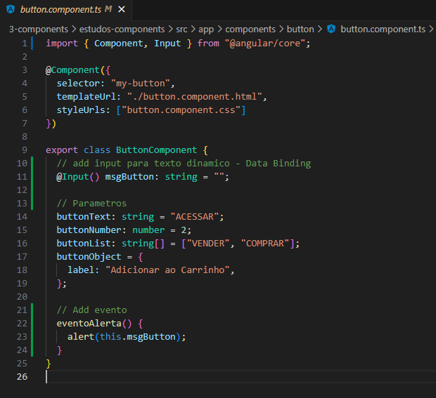
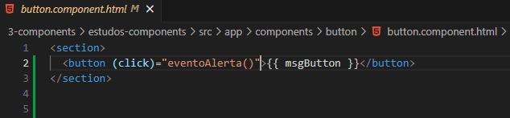
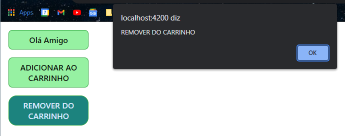

<h1 align="center">Eventos com Angular</h1>

  - Conseguimos usar eventos do HTML como click, mouseover, etc dentro do Angular.

  - Para isso nós criamos o evento dentro da classe do nosso "**component.ts**" e depois chamamos ela no nosso "**component.html.**"

  ___
  <h3>Criando o Evento :</h3>
  

  - Dentro do nosso "**button.component.ts**" nós criamos o nosso evento na nossa "**classe ButtonComponent**" na "**linha 9**".

  - Na "**linha 22**" nós "**criamos o nosso evento**" e dentro dele atribuimos um alert que "**chamará o parametro**" que nesse caso é o "**msgButton**" que se encontra na "**linha 11**" da pagina.

  - Feito isso agora iremos chama-lo no nosso "**component.html**".

  ___
  <h3>Chamando o Evento :</h3> 
  

  - Na linha 2 nós chamamos o nosso evento "**click**" do HTML só que dentro de "**parenteses**", sempre que formos "**usar um evento no Angular**" temos que adiciona-lo dentro de "**parenteses**".

  - Após chamar o evento "**click**" nós iremos declarar "**dentro das aspas duplas**" o nosso evento criado no "**component.ts**", como nesse caso o "**eventoAlerta()**"
  
  ___
  <h3>Resultado ao clicar em um dos Botões :</h3>
  

  - Ao "**clicar em um dos botões**" o nosso "**alerta**" aparece mostrando o nome de cada um dos botões.

  - Isso é apenas para um exemplo más o "**conceito**" é usa-lo para "**executar qualquer tipo de função**" quando um "**evento for chamado**".

___

<h2>Outros Paginas</h2>

  - [Voltar Para a Pagina Sobre Components](https://github.com/henferreirapro/estudos-angular/tree/3-components-angular)

  - [Voltar Para a PaginaComo Fazer Interpolação de Dados](https://github.com/henferreirapro/estudos-angular/blob/3-components-angular/2-interpolar-dados.md)

  - [Voltar Para a Pagina Como Fazer Interpolação de Dados](https://github.com/henferreirapro/estudos-angular/blob/3-components-angular/2-interpolar-dados.md)

  - [Voltar Para a Pagina Como Deixar os Components Mais Dinamicos](https://github.com/henferreirapro/estudos-angular/blob/3-components-angular/3-components-dinamicos.md)