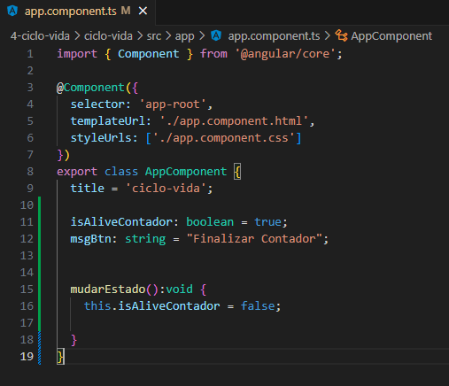
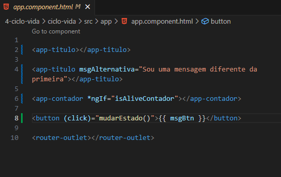
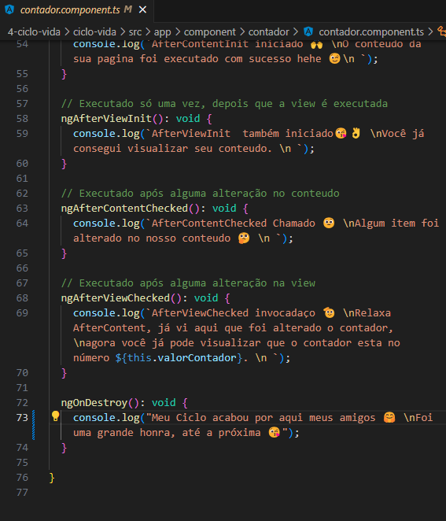
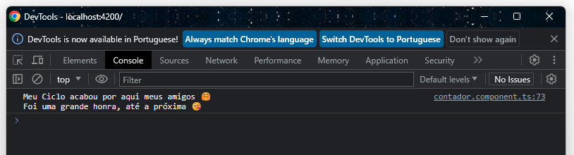

<h1 align="center">On Destroy</h1>

  - "**OnDestroy**" é um evento que serve para podermos saber o momento que o nosso component foi destruido ou finalizado na nossa aplicação.

  - Em outras palavras ele serve para nos dizer que quando o nosso component foi finalizado e não esta mais em uso na nossa aplicação.

  - Irei criar um exemplo que exclui o nosso "**component contador**", no HTML do nosso component, teremos um "***ngif**" que receberá uma "**propriedade booleana**" que passará para se o nosso component é true ou false.

  - Quando ele ficar "**false**" o "**component contador**" será excluido do "**HTML do nosso APP**".
  
  ___
  ___
  <h3>Criando a Propriedade :</h3>
  

  - Na linha 11 criamos a propriedade "**isAliveContador**" que receberá por padrão true.

  - Na linha 12 criei uma propriedade chamada "**msgBtn**" que recebe o nome do "**button**" que iremos usar disparar um "**evento click para excluir**" nosso "**contador**". 

  - na linha 15 criamos uma função chamada "**mudarEstado**" que será usada no button para poder mudar a nossa propriedade "**isAliveContador**" para "**false**".

  ___
  <h3>Adicionando a Propriedade no HTML que chamamos o nosso Contador :</h3>
  

  - Na linha 6 nós adicionamos dentro da tag do "**app-contador**" a propriedade "**isAliveContador**" dentro do "***ngif**".

  - Na linha 8 nós criamos um button que tem um evento de click que irá executar a função mudarEstado criada no "**APP component TS**".

  ___
  <h3>Mensagem do Ondestroy no Arquivo TS do nosso Contador :</h3>
  

  - Na linha 72 nós colocamos a mensagem que será exibida no "**console do navegador**" quando o OnDestroy for executado.

  ___
  <h3>Retorno do OnDestroy no Console do Navegador :</h3>
  

___
___
<h2>Outros Paginas</h2>

[Voltar Para Pagina Inicial de Gerenciamento de Estados](https://github.com/henferreirapro/estudos-angular/tree/4-gerenciamento-estados-angular)
