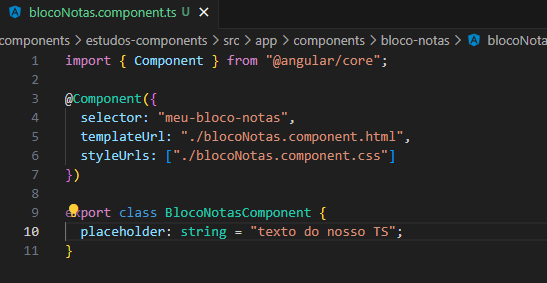
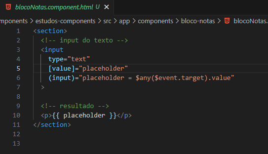
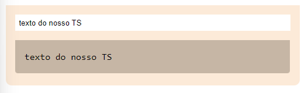
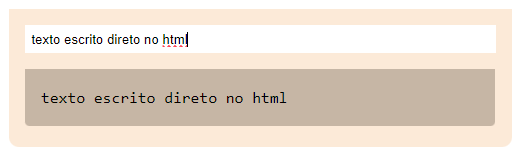

<h1 align="center">Usando Two Way Data Binding</h1>

  - Two Way Data binding é uma comunicação de dois lados, em outras palavras é quando o "**arquivo HTML**" conversa com o "**arquivo TypeScript**" e o inverso disso, quando a parte lógica conversa com a parte visual.

  ___
  <h3>Criando a Propriedade que Iremos usar:</h3>
  

  - No nosso "**component.ts**" criamos uma nova propriedade chamada "**placeholder**" na Linha 10.

  - Na propriedade placeholder declaramos que ela vai receber uma string vazia.

  - Agora vamos fazer o nosso "**HTML**" conversar com nosso "**TS**".
  
  ___
  <h3>Associando nosso TS com nosso HTML :</h3>
  

  <h4>Nosso TS Conversando com nosso HTML :</h4>

  - No nosso "**arquivo HTML**" na linha 5, dentro da nossa tag "**input**", nós pegamos a propriedade "**HTML**" value e colocamos ela dentro de colchetes.

  - Com isso nós podemos passar a nossa propriedade "**placeholder**" que criamos no nosso "**arquivo TS**".

  - Dessa forma nós associamos a nossa "**parte lógica do TS**" a nossa "**propriedade HTML**", então nosso arquivo TS já esta conversando com nosso arquivo HTML.

  <h4>Agora Nosso HTML Conversando com nosso TS :</h4>

  - Na linha 6 nós passamos dentro de parenteses nosso evento "**input**" e dizemos a ele que queremos que o nosso parametro "**placeholder**" armazene o valor do evento que esta sendo passado uma expressão "**$any($event.target).value**"

  -  Quando passamos a expressão "**$any( )**" ela me permite escrever qualquer expressão JavaScript dentro dela.

  - Dentro dela nós chamamos o evento "**$event.target**" e dizemos que queremos pegar a "**propriedade value**" dele.

  - Dessa forma nós estamos fazendo o nosso "**arquivo HTML**" devolver ao nosso "**arquivo TS**" um atributo que nesse caso seria o "**texto armazenado**" dentro do nosso "**input**".

  - Na linha 10 nós passamos dentro da nossa tag "**p**" o nosso placeholder para que ele seja visualmente visto quando digitarmos no input.
  ___
  <h3>Resultado :</h3>
  
  - <h4> Antes de digitar algo no input :</h4>
  

  - <h4> Após digitar algo no input :</h4>
  

___
