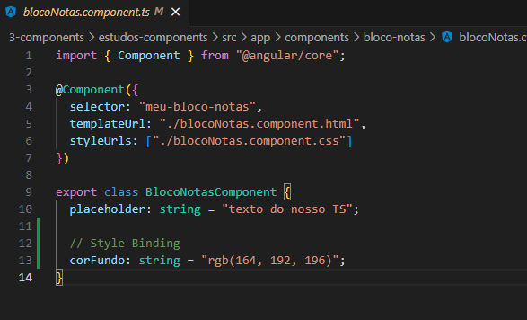
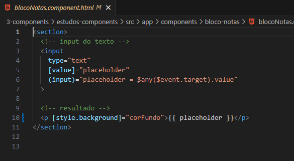
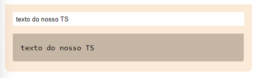

<h1 align="center">Usando Style Binding</h1>

  - Style Binding seria o equivalente ao CSS inline.
  
  - Só que nós criamos os parametros no nosso "**arquivo TS**" como uma propriedade e usamos ele diretamente na "**tag HTML**" do nosso "**component.html**".

  ___
  <h3>Criando Nossa Propriedade Dentro do arquivo TS :</h3>
  

  - Na linha 12 nós criamos a propriedade "**corFundo**" que será usada como atributo do nosso component "**p**" dentro do component.html.

  ___
  <h3>Adicionando Nossa Propriedade no HTML :</h3>
  

  - Na linha 10 dentro da nossa tag "**p**", nós chamamos "**dentro de colchetes**" a nossa "**style.background**" do nosso component.

  - E nela dizemos que o background do nosso component será a propriedade "**corFundo**" criada no nosso "**arquivo TS**".

  ___
  <h3>Resultado :</h3>
  <h4>Antes de aplicar Style Binding :</h4>
  

  <h4>Após aplicar nosso Style Binding :</h4>
  

___
