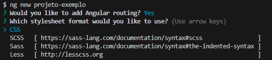

<h1 align="center">Passo a Passo Para Instalar o Angular</h1>

<h3>Primeiro Passo - Instalando o Angular:</h3>
  
  - No seu terminal "**CMD**" ou direto no "**terminal do VSCode**" execute o comando:
  <blockquote>
  
    npm install -g @angular/cli

  </blockquote>  

  - OBS: caso deseje instalar uma "**versão especifica**" só precisa adicionar um "**@**" e o "**número dessa versão**" no final desse código, exemplo:
  <blockquote>
  
    npm install -g @angular/cli@14.1.2

  </blockquote> 

___
<h3>Segundo Passo - Criando um projeto Angular:</h3>

  - Para criarmos um projeto iremos usar o comando:
  <blockquote>
  
    ng new projeto-exemplo

  </blockquote> 

  - O comando ng é um comando já disponivel quando instalamos o Angular, facilitando nosso código.

  - Usando o comando "**nd new**" colocamos o nome do nosso projeto na frente dele, como no exemplo a cima "**projeto-exemplo**".

  Em Seguida o terminal ira perguntar se queremos adicionar o Angular routing, que seria o roteamento com o Angular e qual formato de folha de estilo iremos usar.

  Nesse caso eu vou dizer que desejo adicionar o Angular Routing e que irei usar o CSS como folha de estilo.

  <h4>Exemplo:</h4>
  

___

Para quem quiser visualizar a pasta criada irei deixar o link abaixo para ir direto para ela.

- [Pasta do Projeto de Exemplo](https://github.com/henferreirapro/estudos-angular/tree/2-introducao-angular/instalando-angular/projeto-exemplo)

___
<h2>Veja Mais</h2>

- [Retornar Para Pagina inicial do Repositório](https://github.com/henferreirapro/estudos-angular)

- [Componentes](https://github.com/henferreirapro/estudos-angular/tree/3-components-angular)

- [Gerenciamento de Estados](https://github.com/henferreirapro/estudos-angular/tree/4-gerenciamento-estados-angular)

- [Roteamento](https://github.com/henferreirapro/estudos-angular/tree/5-roteamento-angular)

- [Renderização](https://github.com/henferreirapro/estudos-angular/tree/6-renderizacao-angular)

